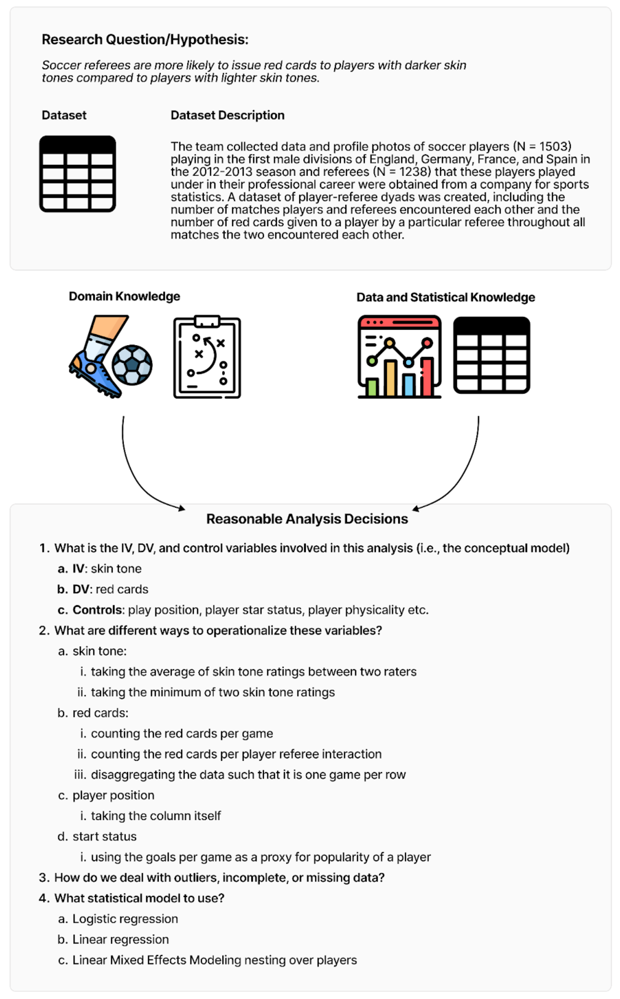
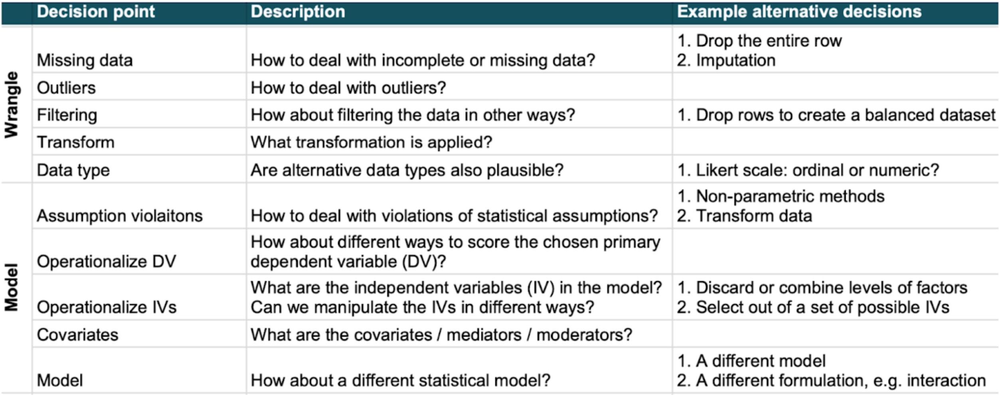
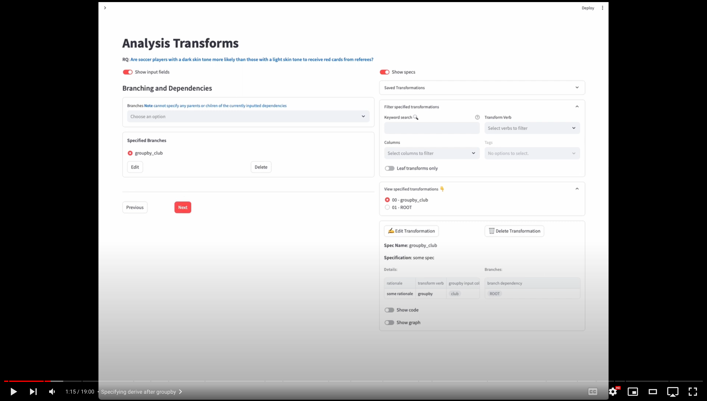
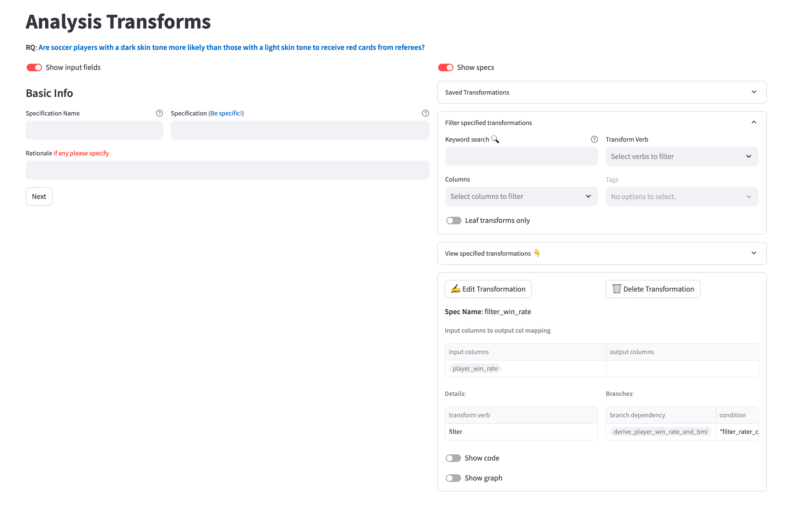
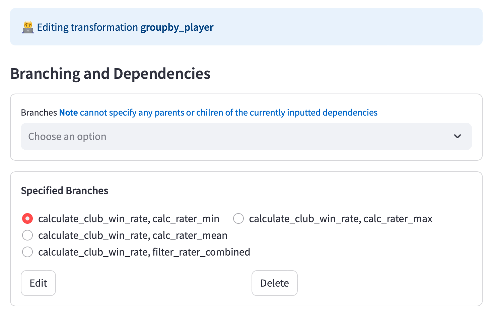
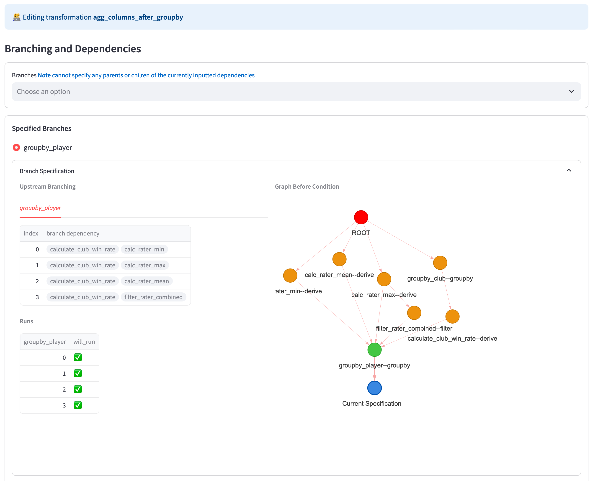
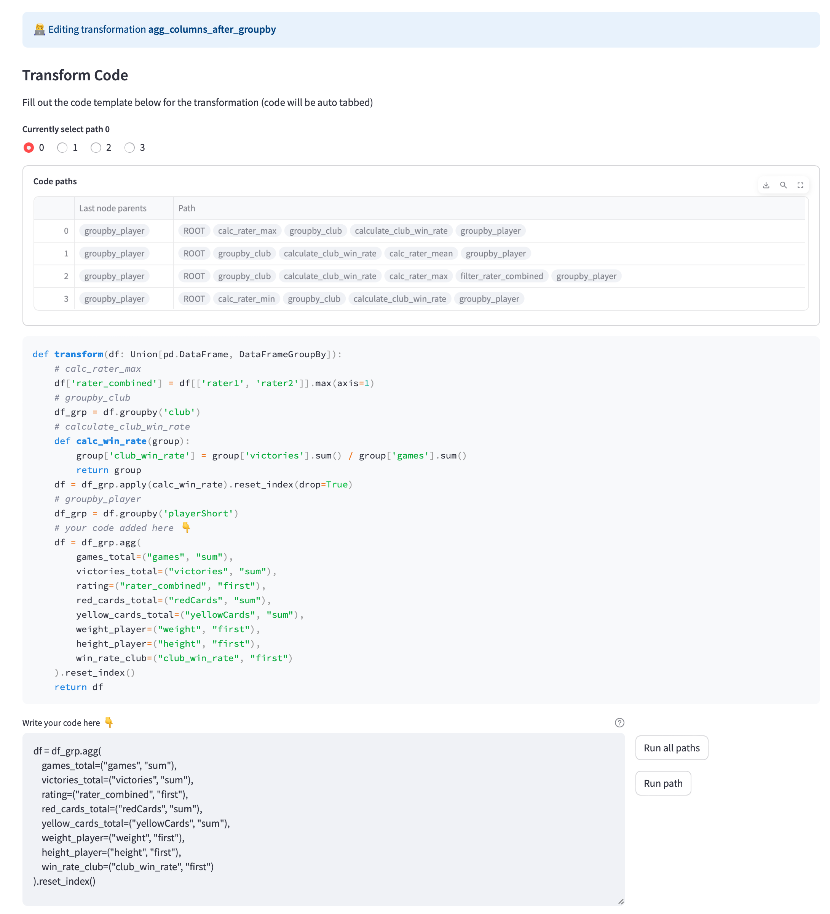
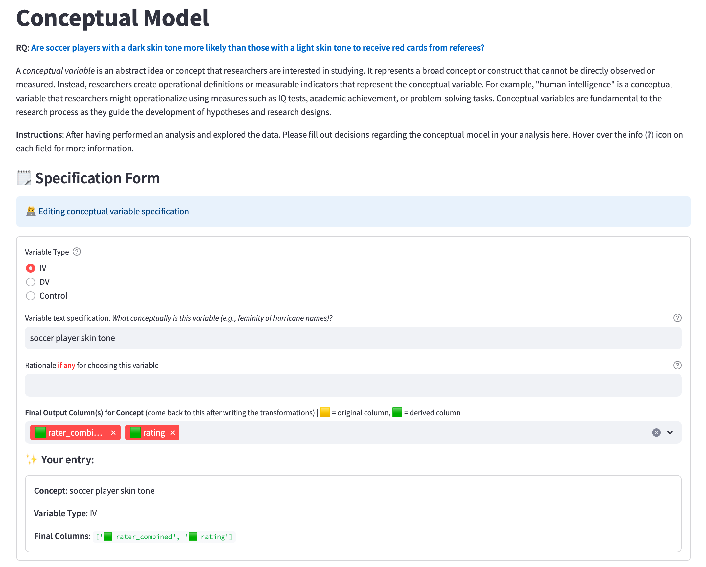
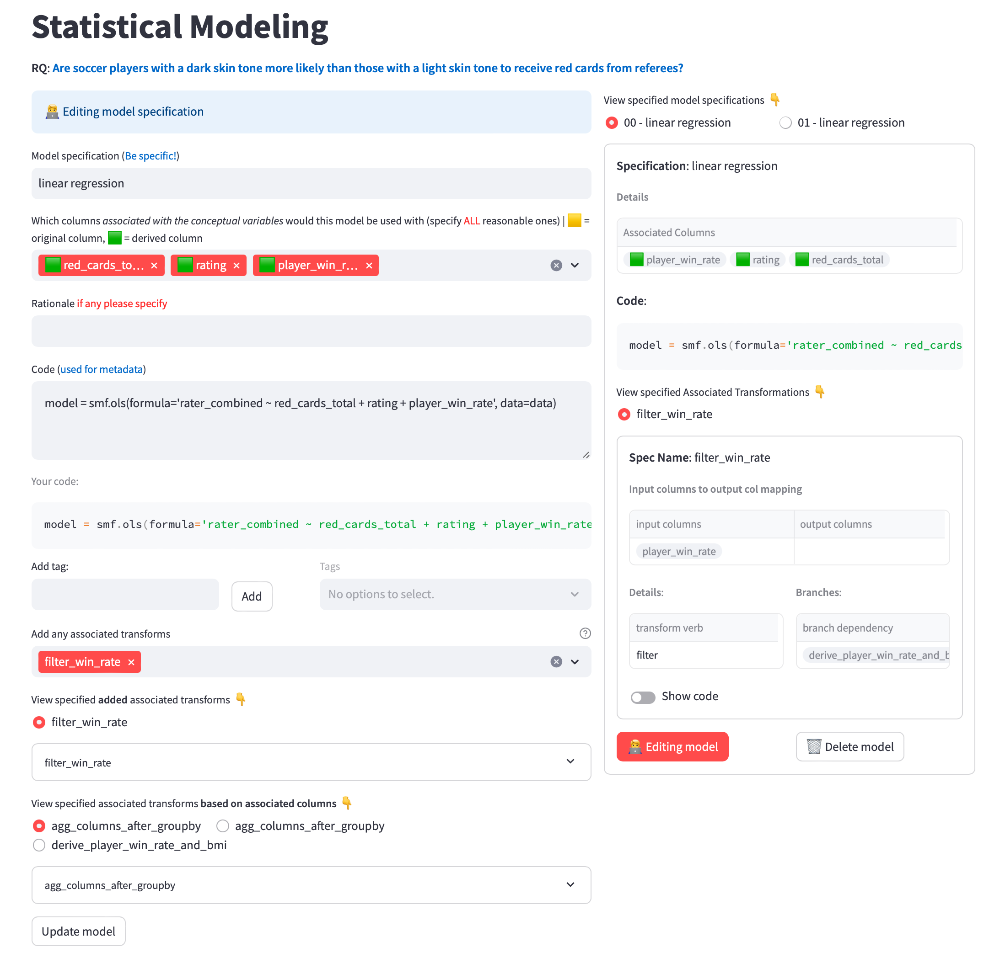
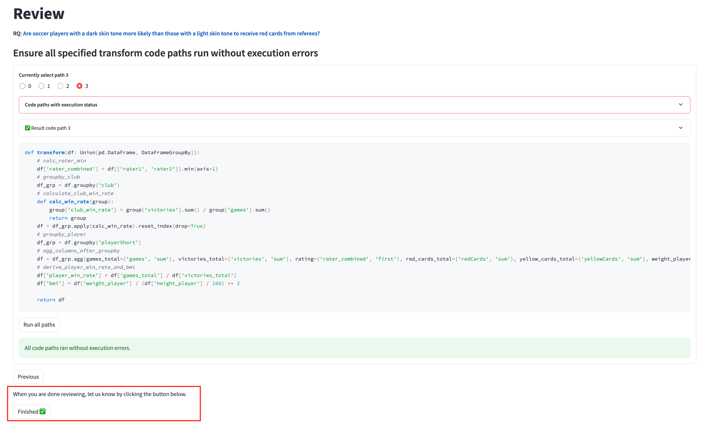

_For the latest updates and common issues, please click here:_

[](Updates.md)

# Analysis Benchmark Annotation Protocol

In a standard scientific analysis, one analyst or team presents a single analysis of a dataset. However, there are often a variety of defensible analytic strategies that could be used on the same data.



At a high level, we want to specify all alternative decisions that you think are reasonable for the analysis (this is well-defined in prior literature as _[multiverse analysis](https://en.wikipedia.org/wiki/Multiverse_analysis)_).

With your help, we would like to collect the ground truth of analysis decisions used for benchmarking the performance of LLMs and agents for data analysis. Your specifications will be used as ground truth from which we measure LLMs against. Here, we describe the protocol for obtaining this data:

# Table of Contents

- [Analysis Benchmark Annotation Protocol](#analysis-benchmark-annotation-protocol)
- [Table of Contents](#table-of-contents)
  - [Part 1 Perform your own analysis](#part-1-perform-your-own-analysis)
    - [Step 1 Conduct the analysis in your own environment](#step-1-conduct-the-analysis-in-your-own-environment)
    - [Step 2 Consider the types of alternative valid decisions in the analysis](#step-2-consider-the-types-of-alternative-valid-decisions-in-the-analysis)
    - [FAQs](#faqs)
      - [What are the expectations for statistical modelling?](#what-are-the-expectations-for-statistical-modelling)
      - [Do I need to include ML models?](#do-i-need-to-include-ml-models)
      - [What do you mean by alternative analysis decisions?](#what-do-you-mean-by-alternative-analysis-decisions)
      - [Where to consider alterneratives?](#where-to-consider-alterneratives)
  - [Part 2 Add your analysis to the UI](#part-2-add-your-analysis-to-the-ui)
    - [Step 1 Add Data Transformations](#step-1-add-data-transformations)
      - [1.1 Basic Info](#11-basic-info)
      - [1.2 Branching and Dependencies](#12-branching-and-dependencies)
      - [1.3 Transform Code and Transform Detials](#13-transform-code-and-transform-detials)
    - [Step 2 Add Conceptual Variables](#step-2-add-conceptual-variables)
    - [Step 3 Add Statistical Model](#step-3-add-statistical-model)
    - [Step 4 Review all specifications](#step-4-review-all-specifications)
  - [Part 3 Labeling Annotations](#part-3-labeling-annotations)

## Part 1 Perform your own analysis


The data and interface to specify your transformations, variable, and statistical modeling choices is available [here](http://bicycle.cs.washington.edu:12000).
We will give you specific datasets to work on.

### Step 1 Conduct the analysis in your own environment

Just like how you did it in the screening pilot task, you need to first conduct a full analysis on this dataset. Please read the research question, and any related background information, and then conduct the analysis. Note that the amount of data transformations needed varies across dataset. It is not always necessary to do a lot of transformations.

**Resources 1**
Example analysis completed by one of the coauthors with the task instructions and background:

[](https://colab.research.google.com/drive/1oKYN1lgyR5w7YTTP1ilsFa_sVAAedLoT?usp=sharing) [](https://docs.google.com/document/d/1KmakwDZ-pb_qJFOc_i6QhJ9iVeJzNpK0q24xCAOqVak/edit#heading=h.oq1dtav6hvu4) [](https://docs.google.com/spreadsheets/d/13pjau1iWvbCkxrt8xBWdGc2CCQlukVxTOpfw-zyBaQs/edit#gid=2084688865)

<!-- | :-------------------------------------------------------------------------------------------------------------------------------------------------------: | :-----------------------------------------------------------------------------------------------------------------------------------------------------------------------------------------------------------------------------------------------: | :---------------------------------------------------------------------------------------------------------------------------------------------------------------------: | -->

**Resources 2**
You can refer to the [model cheatsheet](ModelCheatsheet.md) for the common classes of models that you can use. Note that this is only for reference, and your choice of model is not limited to this sheet.

### Step 2 Consider the types of alternative valid decisions in the analysis

While conducting the analysis, you also need to note alternative analysis decisions and record them into the system. This is because we want to achieve good coverage for the ground truth set that you help to build.

### FAQs

#### What are the expectations for statistical modelling?

As experts, your extensive experience in conducting thorough and iterative model comparison, feature selection, and other analysis steps for your research projects is invaluable. While we encourage you to apply the knowledge and experience gained from your comprehensive analyses, for the purpose of our data collection, we aim for the quality of an "excellent class report." This means that the models should reasonably capture the relationships between variables and effectively address the research question.
Please note that the focus should be on creating models that are reasonable and justifiable, rather than striving for the level of rigor and thoroughness typically required in practice. We trust your judgment in determining which models are appropriate for inclusion in the ground truth dataset.

#### Do I need to include ML models?

No, ML models (e.g. SVM, Random Forest) should not be included because we don't have prediction tasks.

#### What do you mean by alternative analysis decisions?

For a given analysis problem, there is a decision space of reasonable analysis decisions surrounding the conceptual model and data transformations. Alternative decisions are equally justifiable choices within this decision space. The justifiability of decisions involves rationales tied to the data, your analysis method, prior experience, some domain knowledge.

#### Where to consider alterneratives?

- **Transformations**: Alternative decisions can exist for data transformations, such as different ways to operationalize the same variable or different ways to handle missing values.
- **Conceptual Variables**: There may be alternative reasonable answers when specifying aspects of the conceptual model, like the independent variable, dependent variable, covariates.
- **Statistical models**: Multiple statistical models may be justifiable alternatives for the same analysis problem.

Here is a categorization of some of the alternative decision points for your reference:



## Part 2 Add your analysis to the UI

After the analysis, we need to input our analysis into a specific format. We describe this process here. We include a video tutorial as well, which inputs the analysis (very basic toy example) specified in this [notebook](tutorial/soccer_tutorial.ipynb) into the UI.
[](https://www.youtube.com/watch?v=XkaSKPQbSZ8)

You can also access this specification by logging in with the username `tutorial`

### Step 1 Add Data Transformations

Transformations are individual unit data transformations we perform to the data to operationalize it before our model. We have defined a set of [**transformation verbs**](TransformVerbs.md) that represents each transformation. Each transformation should also have only one output column. Therefore, if your involve multiple of these unit transformations, we ask that you break this down.



For each transform we need to specify the following (e.g., [0:07 in the tutorial](https://youtu.be/DdiMZNhu7do?si=TcW-ZYASWMTuNYuX&t=7)):

#### 1.1 Basic Info

- **Specification Name**: A short unique name in snake case (using "\_" as spaces) to identify this transformation (makes it easy to identify)
- **Specification**: a more descriptive sentence detailing the transformation. Another analyst should be able to code the exact transformation based on this description
- **Rationale**: Explain why this transformation was chosen.

#### 1.2 Branching and Dependencies

If the transform relies on another transform to occur before for it to be valid or even run, we
specify that here. A _branch_ represents an alternative code path. Each branch depends on a different set of parent transformations (each branch can depend on 1 or more transformations).

✨✨ Note, all parent transforms for each branch should be specified already.

**Branches Field**

In the **Branches** field we can add a branch by first specifying which transformation(s) are this current specification's immediate parents. (e.g., [4:28 in the tutorial](https://youtu.be/DdiMZNhu7do?si=u0P8XukYIHPCBR6j&t=268)).

In this `groupby_player` transform spec example below, we specify four different alternative branches. Each of these branches depends on two previously specified transforms. The branches are:

1. `calculate_club_win_rate`, `calc_rater_min`
2. `calculate_club_win_rate`, `calc_rater_max`
3. `calculate_club_win_rate`, `calc_rater_mean`
4. `calculate_club_win_rate`, `filter_rater_combined`



**Branch Info**

For each branch, if there are multiple branches in upstream parent specifications, you will the alternatives paths here as well.

For example, for the `agg_columns_after_groupby` transform which depends on the `groupby_player` transform, we see the four alternative transform paths and the graph of all parent specifications. Specifically, because `groupby_player` is a parent of the current specification, and has more than alternative branch, we can that here.


For the graph, each _node_ in this graph (with the exception of ROOT) represents a specified unit transformation.
Each _directed edge_ A -> B represents a specified dependency of transform B on transform A.

**This may not be a comprehensive set so if your transform does not fit let us know**

**Conditions**

Sometimes, we may only want a current specification to run based on some condition or constraints on the choice of upstream specification. We can write a condition to specify this (see [7:36](https://youtu.be/DdiMZNhu7do?si=--UcC2-hBykYCLyL&t=455) and [11:38](https://youtu.be/DdiMZNhu7do?si=R_HvpADef9kJLFUv) in the tutorial video).

A condition is a python boolean expression that is evalutated on upstream branching. Each transformation on an upstream branch is treated as a list. We can use the keywords `and`, `or`, `in` and `not` to write our expression. For example, if our current spec has the `groupby_player` in its ancestors (i.e., there is a path from `groupby_player` to the current spec) and we want to say that this specification should only occur on the branch containing "filter_rater_combined" we can write the expression below:

```python
# only run ind 3 will occcur
"filter_rater_combined" in groupby_player
```

Alternatively, if we want branches that do not have "calc_rater_min" then we write:

```python
# run inds 1,2,and 3 will occur
not "calc_rater_min" in groupby_player
```

Likewise, if we want paths 1 and 3 to occur, we can write:

```python
"calc_rater_max" in groupby_player or "filter_rater_combined" in groupby_player
```

#### 1.3 Transform Code and Transform Detials

This part is super important to be correct because this is what we compare benchmark participants against.

**Transform Code**


Based on your specified branches and dependencies, you should see all the parent code paths.
Write the code for the transformation here. It will be the same for each path and if the dependencies are specified correctly there should be no issue.

After writing the code, run all paths to ensure that the code runs without execution errors and that the result is what you intended to specify. This part is super important because we will be comparing the output of each transformation with those of benchmark participant's.

**Transform Details**

Based on your code, add the transform details:

- **Transform verb**: Select one of the transform verbs that fit this transformation. Note we seperate groupby and post groupby operations even though they are often written together as one expression. These verbs could not be comprehensive so if you find that a verb does not fit your transformation please put "other" for now and let us know!
- **Input to output column mapping**: Based on the selected transform we add a mapping of the input columns to every output column for this transformation. Input columns are columns of the dataframe that are used in the transformation. The output column is any column that is created as a result of the transformation (this column name must match the columns created in the data from running the code)
- **Tags**: [Optional] These are used just for you to keep track of your specified transforms

### Step 2 Add Conceptual Variables

This is where we specify the high-level variables that are related to the research question and dataset (see [13:09 in the tutorial](https://youtu.be/DdiMZNhu7do?si=5eGWNf30f5iuCRoB&t=789)). Please inlcude all conceptual variables that you think are relevant and **justified**.

> A conceptual variable is an abstract idea or concept that researchers are interested in studying. It represents a broad concept or construct that cannot be directly observed or measured. Instead, researchers create operational definitions or measurable indicators that represent the conceptual variable. For example, "human intelligence" is a conceptual variable that researchers might operationalize using measures such as IQ tests, academic achievement, or problem-solving tasks. Conceptual variables are fundamental to the research process as they guide the development of hypotheses and research designs.



For each conceptual variable please include:

- **Variable type**: IV, DV, or Control
- **Text specification**: A description fo the conceptual variable/construct
- **Rationale**: Why this variable is reasonable for the analysis considering the specifics of the research question and dataset (e.g., data availability, quality, suitability etc.)
- **Final Output Column(s) for the Concept**: Specify all column(s) either originally in the data or derived from your transformations that you use to operationalize this conceptual variable
- **Rationale for each output column**: Please add an explanation for why each column is chosen to represent this conceptual variable. Or why this transformed version is necessary to represent this conceptual variable. 

*for the rationales here (why the variable is included and ratioanle for the transformation to deriving each column), they will used when other analysts review the choices you made and determine whether the choice is reasonable*

### Step 3 Add Statistical Model

Here, we specify all alternative statistical models (see [14:46 in the tutorial](https://youtu.be/DdiMZNhu7do?si=k2Yh6sFC2S6_XhV4&t=886)).



For each model please specify:

- **Model specification**: The name of the model. This should be specific enough that another analyst can write the code for your model based on this specification.
- **Associated columns**: Which derived columns you had specified in your conceptual variables are included in this model. The associated columns should include at least an DV and IV.
- **Rationale**: Why is this model included?
- **Code**: Copy paste the code you used to write this model
- **Tags**: [Optional] These are used just for you to keep track of your specified models
- **Associated transforms**: Sometimes after deriving a column, we may make additional transformations to the data before our model such as additional filters or droping missing values etc. Here we can specify the final transformation(s) associated with this model.

### Step 4 Review all specifications

After inputting our specifications, we perform a final review to ensure there are no mistakes or inconsistencies (see [16:07 in the tutorial](https://youtu.be/DdiMZNhu7do?si=ZM1vMwMPiB_pgoGw&t=968)).

You can view your specifications (transforms, conceptual variables, and statistical models) in the `Summary` page.

In the `Review` page, ensure that there are no warning messages. If there are warning messages, please go back to the specifications and make any neccessary fixes.

Next, run all code paths again to perform a final check that there are no execution errors.

Finally, once you've finished all the previous steps for this dataset and reviewed all the code paths, you can click the "Finished" button as shown below to notify us about your completion.



## Part 3 Labeling Annotations


Some time afer completing Part 1 and 2, we will provide you additiontional analysis specifications for you to review. The purpose of this is to make our existing specifications more comprehensive as well as provide multiple choice tasks to your benchmark to get a more nuanced understanding of agent/LLM performance.

All you need to do is go to the **Labeling Annotations** page and follow the instructions there. Be sure to save your annotations or it won't be updated in the database!

### Annotation Phase Instructions

**Goal of this phase is to strengthen our ground truth by:**
- Generating some negative examples in the benchmark multiple choice tasks for LLMs
- Reviewing each others’ inputs for higher quality and validity
- Getting inspired from these inputs and add more to your ground truth set
    - We encourage you to take notes along the process and add something to your own dataset if something inspires you of a cv/transform/model that you don’t see in the labeling or your own ground truth dataset
    - 🚀 The more we can claim our ground truth to be **comprehensive** the stronger our paper.

For each of the conceptual variables, make 2 independent judgements:
* Q1a: Can this variable be derived from the columns (you can open up the column description on the side)
* Q1b: Is it reasonable to include this variable in subsequent modeling to sufficiently answer the RQ?
    * Provide a rationale for your decision
* Q1c: Is the given rationale (not the one you just wrote) reasonable for why they choose to include this conceptual variable?

For each of the transformations, make 2 independent judgements:
* Q2a: Is the choice of transformations reasonable to derive this variable?
* Q2b: Is the coded transformations consistent with and reasonable for the approach for deriving this column?
* Provide a rationale for both of the above decisions
* Q2c: Is the given rationale (not the one you just wrote) reasonable for why they choose to perform this transformation?

**Important things to note:**
❗️ When answering the above the framing you should have is to think whether it would be reasonable to have the conceptual variable or transforms in any reasonable analysis given the research question and dataset.

* Q: What if the conceptual variable is reasonable and can be derived, but I don’t agree with its rationale?
  A: Given the framing above. You should still put “Yes” for both these labels, because the rationale are just used to facilitate, but independent of your other labels.


* If a transformed variable combines the dependent variable (DV) and independent variable (IV), such as DV divided by IV, it can make it difficult to directly examine the relationships between the DV, IV, and control variables. While the transformed variable itself may not be incorrect, it may hinder the ability to easily answer the research question by obscuring the individual effects of the IV and control variables on the DV

